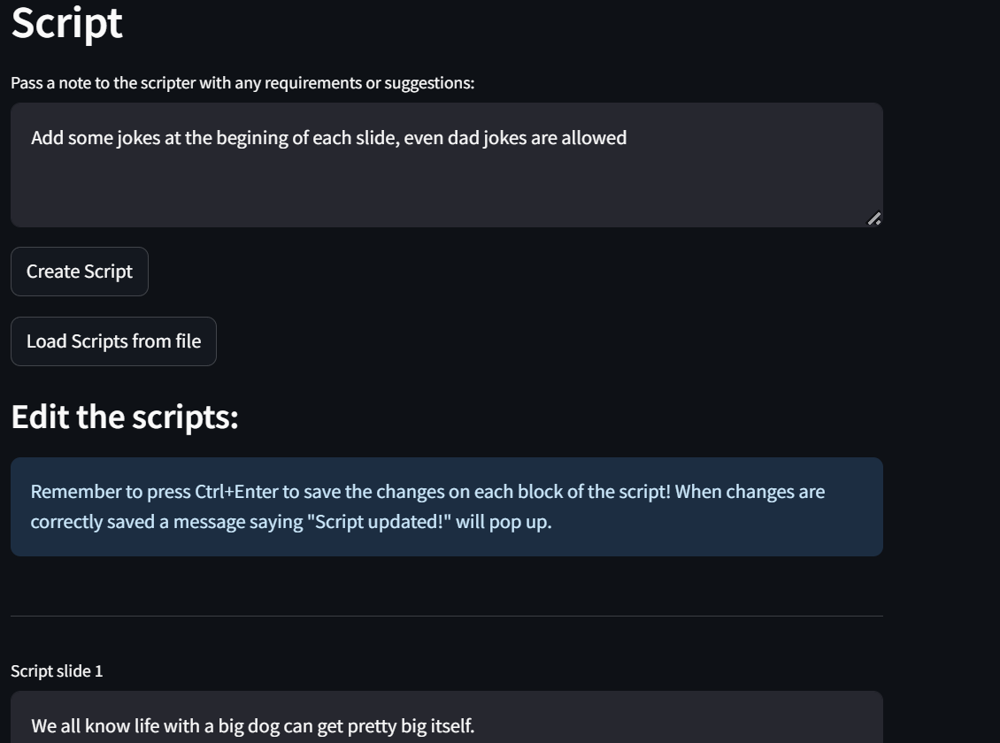

<p align="center">
  
</p>


# Slideo: AI-Powered Presentation Builder

Slideo is an AI-driven tool designed to streamline the creation of engaging slide presentations and convert them into polished videos. Leveraging language models, image search APIs, and multimedia processing libraries, Slideo automates:
- **Slide Layout Design:** Generate structured slide layouts using AI prompts that respect timing constraints and content balance.
- **Content Generation:** Produce tailored slide text, bullet points, and comparisons.
- **Image Integration:** Search for and download relevant images (or thumbnails) via SerpAPI.
- **Script Writing:** Create a natural, engaging narrator script based on slide content.
- **Video Creation:** Convert your PowerPoint presentation into a video with audio narration.
- **User-friendly GUI:** All features are accessible through an intuitive interface that provides complete control over customizing and refining the AI-generated content.

## GUI images:

<p align="center">
  
  <br>
  <em>Main interface and options</em>
</p>

<p align="center">
  
  <br>
  <em>AI-generated slide layout preview and customization</em>
</p>

<p align="center">
  
  <br>
  <em>Image selection interface with thumbnail previews</em>
</p>

<p align="center">
  
  <br>
  <em>AI-suggested image search queries for your content</em>
</p>

<p align="center">
  
  <br>
  <em>Script generation and editing interface</em>
</p>

<p align="center">
  
  <br>
  <em>Video creation progress tracking</em>
</p>

---

## Features

- **AI Layout Management:** Uses prompts to design slide layouts based on the presentation topic, duration, and content type.  
  - **Available Slide Templates:**  
    - Title  
    - Section Title  
    - Content (bullet points)  
    - Content (comparison in 2 columns)  
    - Single image  
    - Multiple images  
    - Index  

- **Image Search & Handling:**  
  - Generates relevant search queries for a topic using an LLM.
  - Downloads thumbnails and full-resolution images via SerpAPI: thumbnails enable efficient selection while full images are used in the final presentation.

- **Presentation Building:**  
  - Uses [python-pptx](https://python-pptx.readthedocs.io/) for slide creation.
  - Images are added to their corresponding sildes via fuzzy matching between image descriptions and slide descriptions.
  - Uses Llama models via GroqAPI.
  
- **Narrator Script and Audio Generation:**  
  - Analyzes slide content (text and images) to generate contextually relevant narration scripts.
  - Creates natural, engaging narration using AI prompts for presentation flow.
  - Converts scripts to professional voiceovers using ElevenLabs text-to-speech API.

- **Video Production:**  
  - Converts PowerPoint slides to images (via COM on Windows).
  - Uses [moviepy](https://zulko.github.io/moviepy/) to merge slides and audio into a video with smooth transitions.

- **GUI Integration:**  
  - A [Streamlit](https://streamlit.io/) web interface in **GUI.py** allows for easy configuration, API key management, and step-by-step presentation creation.

---

## Directory Structure

```plaintext
javiimo-slideo/
├── Readme.md
├── GUI.py
├── LICENSE
├── image_search.py
├── layout_manager.py
├── main.py
├── presenter.py
├── scripter.py
├── slides_builder.py
├── utility_functions.py
└── video.py
```

- **GUI.py:**  
  Provides a Streamlit-based interface for managing API keys, configuring presentation settings, selecting images, generating layouts, and finally creating slides, scripts, and videos.

- **image_search.py:**  
  Handles image searching and downloading using SerpAPI.

- **layout_manager.py:**  
  Constructs slide layouts by generating AI prompts based on presentation context, duration, and slide types.

- **main.py:**  
  A command-line entry point that orchestrates the entire presentation creation process (from query generation to video creation).

- **presenter.py:**  
  (Reserved for additional presentation-related functionality.)

- **scripter.py:**  
  Extracts content from slides and generates narration scripts using AI, ensuring the narration is engaging and aligned with slide content.

- **slides_builder.py:**  
  Uses python-pptx to create and populate the PowerPoint presentation based on the layout and image mappings.

- **utility_functions.py:**  
  Contains helper functions for saving layouts, estimating presentation duration, managing file directories, and more.

- **video.py:**  
  Converts the generated presentation into a video using PowerPoint slide conversion and moviepy for audio–video merging.

---

## Setup & Installation

1. **Clone the repository:**

   ```bash
   git clone https://github.com/yourusername/javiimo-slideo.git
   cd javiimo-slideo
   ```

2. **Install Dependencies:**

   Ensure you have Python 3.7+ installed. Then install the required packages (consider creating a virtual environment):

   ```bash
   pip install -r requirements.txt
   ```

   If you're using Conda:

    ```bash
    conda env create -f requirements.yml
    conda activate <your_env_name>
    ```

3. **API Keys Configuration:**

   - API keys can be added through the GUI interface. The keys are stored in an encrypted configuration file (`config/apikeys.enc`). Note that while the keys are encrypted, the encryption key itself is currently hardcoded in `GUI.py` (line 26). For better security, you should modify this encryption key before use.

4. **Platform Requirements:**

   - The PowerPoint conversion via COM in **video.py** only works on Windows.
   - Ensure you have Microsoft Office installed for slide conversion.

---

## Usage

### Graphical User Interface (GUI)

Run the Streamlit application to use the interactive interface:

```bash
streamlit run GUI.py
```

The GUI allows you to:
- Set the presentation topic and additional comments.
- Generate image search queries and select thumbnails.
- Build a slide layout and edit slide descriptions.
- Generate the PowerPoint presentation.
- Create narration scripts and convert the presentation into a video.

### Command-Line Mode

To run the entire presentation creation process via the command line, execute:

```bash
python main.py
```

This script will guide you through:
- Entering presentation details.
- Generating and selecting images.
- Building the slide layout.
- Creating the PowerPoint file.
- Generating the narration script.
- Producing the final video output.

Notice there are some limitations within the command line implementation, such as modifying the outputs of the LLMs or choosing images. It was written only for the purpose of testing the complete pipeline.

---

## License

This project is licensed under the MIT License. See the [LICENSE](LICENSE) file for details.

---

## Acknowledgements

- Developed by **Javier Montané Ortuño** during an internship at FOREO (October 2024 - March 2025) under the guidance of Frank Ravanelli and Sofiya Nasiakaila.
- Uses advanced language models and image APIs to simplify the creation of multimedia presentations.
- Thanks to the maintainers of [python-pptx](https://python-pptx.readthedocs.io/), [Streamlit](https://streamlit.io/), and [moviepy](https://zulko.github.io/moviepy/) for their fantastic libraries.

---

Feel free to contribute, open issues, or suggest enhancements.

**Happy Presenting!**

